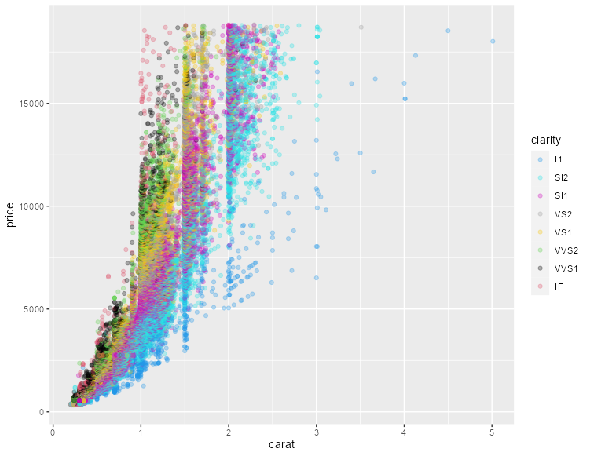

# KaradaColor

<!-- badges: start -->

<!-- badges: end -->

Color palette of "[KARADA-GOOD](https://www.karada-good.net/)". The color palette consists of five colors selected from photographs of Japanese landscapes and foods. Color palette will be added sequentially.

Color palettes to be added are introduced on [Instagrame](https://www.instagram.com/karadagood/) from time to time.


## Installation

You can install the development version of KaradaColor from [GitHub](https://github.com/) with:

``` r
# install.packages("devtools")
devtools::install_github("KaradaGood/KaradaColor")
```

## Example

``` r
library(KaradaColor)
#Display all palettes in console
Show_KG_Palette()
```


``` r
#Plot the palette
Plot_KG_Palette("Kyoto_City", n = 10, colplot = TRUE)
```


``` r
#Exsample
if(!require("tidyverse", quietly = TRUE)){
  install.packages("tidyverse");require("tidyverse")
}
ggplot(data = diamonds, aes(x = carat, y = price)) +
  geom_point(aes(color = clarity), alpha = 0.3) +
  scale_colour_manual(values = factor(Plot_KG_Palette("Sapporo_Sta",
                                                      n = 8,
                                                      colplot = FALSE)))
```


