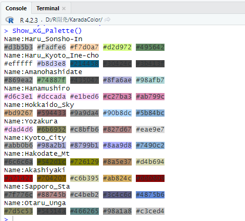
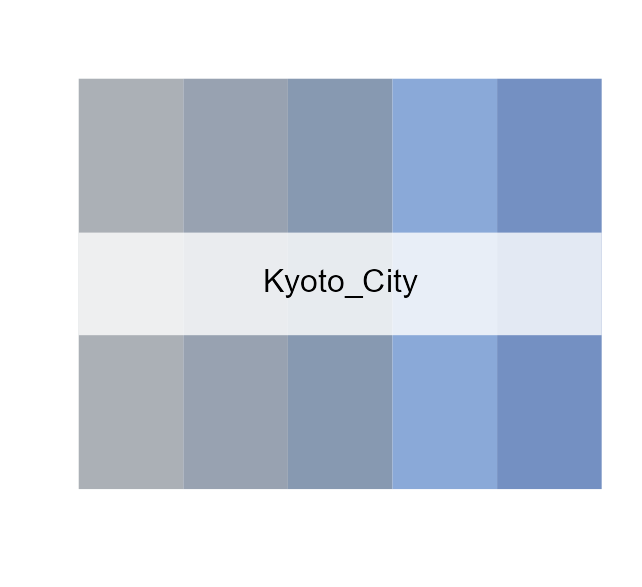
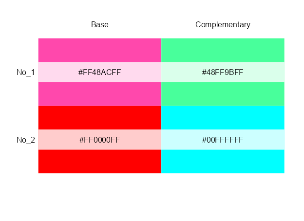
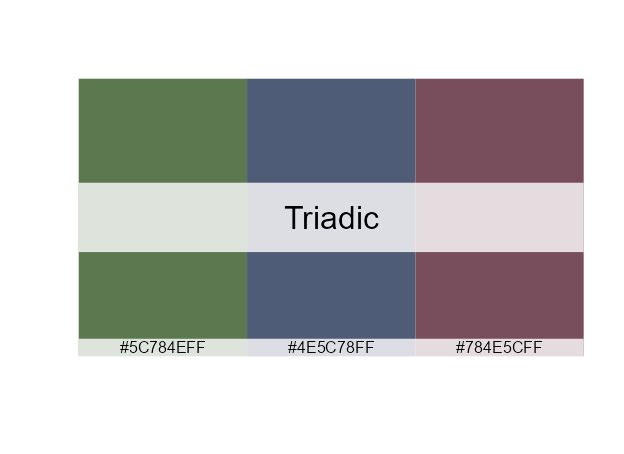
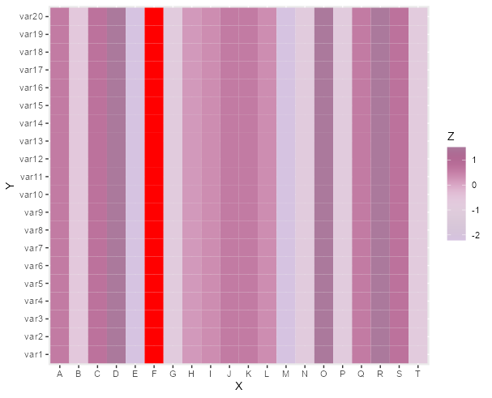
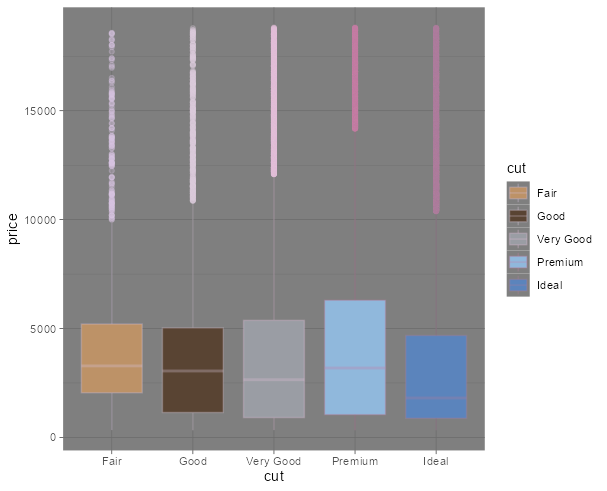
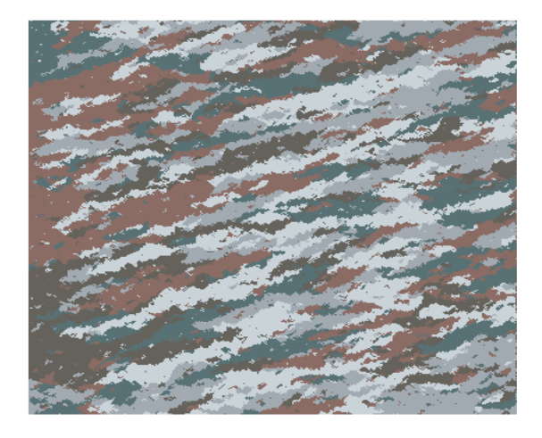

# KaradaColor

<!-- badges: start -->
[](https://cran.r-project.org/package=KaradaColor)
[](https://github.com/metacran/cranlogs.app)
[](https://github.com/metacran/cranlogs.app)
<!-- badges: end -->

Color palette of "[KARADA-GOOD](https://www.karada-good.net/)". The color palette consists of five colors selected from photographs of Japanese landscapes and foods. Color palette will be added sequentially.

Color palettes to be added are introduced on [Instagrame](https://www.instagram.com/karadagood/) from time to time.


## Installation
Get the released version from CRAN:
``` r
install.packages("KaradaColor")
```
Or the development version from github:
``` r
# install.packages("devtools")
devtools::install_github("KaradaGood/KaradaColor")
```

## Example

``` r
library(KaradaColor)
#Display all palettes in console
kg_show_console()
```



``` r
#Plot the palette
kg_plot_color("Kyoto_City", n = 5, showcode = TRUE)
```



``` r
#Create complementary color: kg_create_cc() command
kg_plot_color(color = kg_create_cc())
```



``` r
#Create triad color: kg_create_tc() command
kg_plot_color(color = kg_create_tc())
```



## ggplot2
The package contains colour scale functions for `scale_color_kg()` and `scale_fill_kg()`. 
Missing values are initially displayed in red.

``` r
#Continuous scale exsample
if(!require("tidyverse", quietly = TRUE)){
  install.packages("tidyverse");require("tidyverse")
}
set.seed(1)
x <- LETTERS[1:20]
y <- paste0("var", seq(1,20))
data <- expand.grid(X=x, Y=y)
data$Z <- sample(c(NA, rnorm(15)), 20, replace = TRUE)
library("tidyverse")
ggplot(data, aes(X, Y, fill= Z)) +
  geom_tile() +
  scale_fill_kg(discrete = FALSE, name = "Hanamushiro",
                alpha = 1, na.value = "red")
```



``` r
#Discrete scale exsample
library("ggplot2")
ggplot(data = diamonds, aes(x = cut, y = price,
                            color = cut, fill = cut)) +
  geom_boxplot() +
  scale_color_kg(name = "Hanamushiro", alpha = 0.3) +
  scale_fill_kg(name = "Hokkaido_Sky", alpha = 1) +
  theme_dark()
```



## aRtsy and other packages
This can be done with the kg_get_color() command.
``` r
library("aRtsy")
set.seed(1234)
canvas_strokes(colors = kg_get_color(name = "Otaru_Unga"),
               neighbors = 1, p = 0.02, iterations = 1,
               resolution = 350)
```


